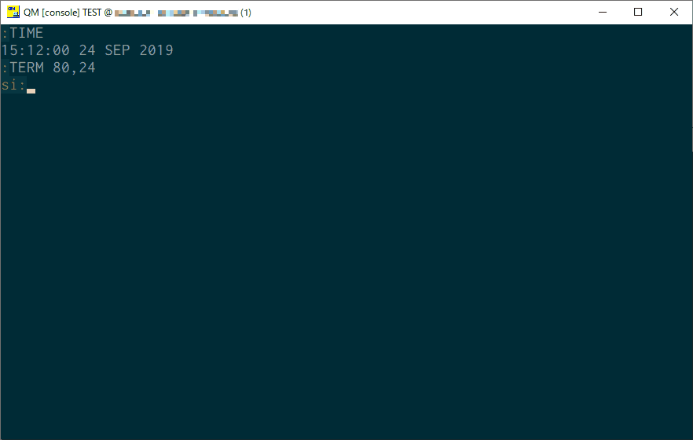
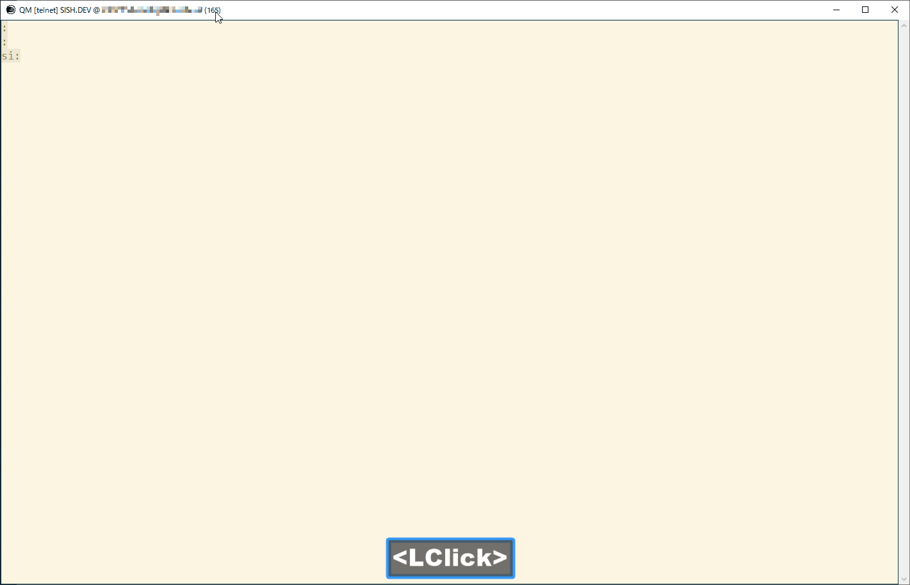

= SISH (SImount Shell) =
:experimental:

Unix like Shell for OpenQM and UniVerse

== 概要 ==

入力補完などUnix系のShellに近い操作でコマンドライン入力が出来るようになります。 +
また、データ(Item)やBASICソースを効率よく編集するスクリーンエディタも備えています。 +
テキスト入力はWindowsのキーバインドをベースにしています。



== 特徴 ==

==== コマンドライン
* VOCに登録されている単語の入力補完機能によりミスが少なく迅速な入力が可能となります。(kbd:[TAB]) +
  * もう一度 kbd:[TAB] を押すと一覧からのインクリメンタル検索とカーソルによる選択が出来るようになります。
* 一度入力したコマンドはコマンド履歴からインクリメンタルサーチする事が出来ます。 (kbd:[Ctrl+R])
  ** その状態で kbd:[TAB] を押すと一覧からのインクリメンタル検索とカーソルによる選択が出来るようになります。
* 大文字小文字反転入力のON/OFF切り替え。 (kbd:[F9])
* 複数行コマンド実行。複数行で１つのコマンド履歴になるのでパラグラフ化しないでもすぐに複数行コマンドが実行できます。
  ** kbd:[Ctrl+Enter]でコマンドラインが複数行になります。
  ** コマンド履歴選択中に kbd:[Shift+↑] kbd:[Shift+↓] で複数行のコマンドの選択になりまとめて実行される。
* 実行時間計測モード `.T`

==== エディタ
* BASICソースもテーブルのレコード(ITEM)も同じ操作性で編集できます。
* BASICソースの構文ハイライト表示により入力ミスが軽減されます。
* カーソル移動の効率を高めるジャンプ機能
  ** アウトライン一覧を表示して指定ラベルにジャンプ (kbd:[Ctrl+O])
  ** 変数宣言元にジャンプ (kbd:[Ctrl+G])
  ** ジャンプ前のカーソル位置に戻る (kbd:[Alt+←] , kbd:[Alt+→])
* 開いているファイルと以前に開いていたファイルをインクリメンタル検索で探して開く(kbd:[Ctrl+P])
* ダイブ(kbd:[F4])によりマルチバリューを改行区切りで編集出来ます。

==== その他
* kbd:[F12] で黒背景/白背景の配色モード切り替え。(プロジェクタに映すときは白背景が便利)
* コマンドラインとエディタ共にカーソル移動や範囲選択によるコピー＆ペーストはWindowsのキーバインドで操作できます。
（設定ファイルにより自分好みのキーバインドに変更可能）

== 対象プラットフォーム ==

* OpenQM 4.0系 or later (4.0-3で動作確認しています)
* UniVerse 11.2系 or later (11.2.1で簡単な動作確認しています)

== セットアップ ==

=== SISHのインストール 

コンパイル済みオブジェクトをダウンロードしてグローバルカタログすることで利用できるようになります。

==== OpenQM

link:QM.BP.OUT/SISH[QM.BP.OUT/SISH] を 'gcat' フォルダに配置します。

    cd /usr/qmsys/gcat
    wget -N https://github.com/simount/SISH/raw/master/QM.BP.OUT/SISH

ターミナルから以下のコマンドで起動します

    :SISH

==== UniVerse

link:UV.BP.O/SISH[UV.BP.O/SISH] を オブジェクトフォルダに配置します。

    cd /usr/u2/uv/BP.O
    wget -N https://github.com/simount/SISH/raw/master/UV.BP.O/SISH

ターミナルから以下のコマンドでグローバルカタログします

    LOGTO UV
    CATALOG BP *SISH SISH

以下のコマンドで起動します

    >*SISH

=== クライアント端末側の設定

==== ローカル接続 on Windows

必須バージョン: QM3.4-12以降、Windows10(1803)以降 +
QM Console (qm.exe) で動作します。以下のカスタマイズを行うとより使いやすくなります。

[クリップボード貼り付け] +
以下の `win32yank.exe` を system32 に配置すれば、貼り付けで画面が点滅する問題を回避できます。
https://github.com/equalsraf/win32yank

==== リモート接続 from Windows Client

.ターミナルエミュレータ（クライアント端末）のダウンロード

link:http://ice.hotmint.com/putty/[putty GDI] をダウンロードします。 +
同梱のlink:putty.ini[putty.ini]をputty.exeと同階層に配置します。

NOTE: Linuxや他のターミナルエミュレータでもxtermの制御シーケンスに対応していれば、設定ファイルの修正で概ね動作可能です。 +
詳しくは、<<sec_customize>>を参照。


== 機能 ==

==== コマンドライン入力時の単語補完入力機能 ====

単語入力途中に kbd:[TAB] で複数候補が無い部分まで補完、もう一度 kbd:[TAB] で候補リストを表示します。 +
補完対象は以下にです。

- VOC内の `Verb` , `File` , `PAragraph` , `Keyword` など
- 辞書ファイルのフィールドID（コマンドラインをカーソル位置から遡って初めに見つかるFILEが対象）
- レコード数1000件未満のファイルのレコードID
- フラットファイルの単語の次の単語の場合に限り、対象フラットファイルのレコードID
- `,` 後のマルチパートファイル
- `LOGTO` コマンドの後は登録アカウントテーブルの内容から補完
- `%` 後のL-Typeフィールドの辞書フィールド補完に対応(OpenQM)
- `server:account:file` 等の拡張ファイル表記(OpenQM)
- 単語に `/` or `\` を含むか　`PATH:` で始まる場合にOSパスの補完(OpenQM)

補完対象の単語は大文字小文字の区別なく検索されます。 +
候補リスト表示中は候補を上下キーで選択。文字入力するとインクリメンタル検索でフィルタリングされます。 +
kbd:[Ctrl+Enter]で連続選択できます。 +
kbd:[ESC] で候補リスト表示を抜けます。

==== コマンド履歴の保存機能 ====

アカウント内に `./stacks` フォルダを作成しておくことでコマンド実行履歴が +
`ログインユーザ名$プログラム名` の形式で保存されます。 +
SISHシェル起動時や `LOGTO` によるアカウント移動時にそのコマンド実行履歴が存在すると +
そこからコマンド履歴を構築しますので以前に入力した内容が復元されます。 +
kbd:[Ctrl+R]でコマンド履歴のインクリメンタル検索ができます。また、そこから kbd:[TAB] で絞り込み候補一覧のカーソル選択モードに切り替わります。

==== 複数行コマンドの実行と編集 ====

kbd:[Ctrl+ENTER] で改行することによってもコマンド行を増やすことができます。 +
kbd:[Shift+↑] kbd:[Shift+↓] で編集対象のコマンド行をコマンド履歴から増やすことができます。 +
kbd:[ENTER] で複数行編集領域全体を実行します。行選択されている場合は選択行のみ実行します。 +
コマンドに `LOOP` `$ECHO` `GO` とラベルを含む場合はパラグラフとして実行する方法に切り替わります。 +
複数行で実行したものはコマンド履歴で１かたまりとなる。 +
これによりパラグラフとして名前を付けて保存することなく複数行をまとめたコマンドをインクリメンタル検索などからすぐに呼び出せます。

==== 英小文字大文字反転入力の切替機能 ====

kbd:[F9] キーでON/OFFを切り替えます

==== 背景色の切替機能 ====

kbd:[F11] 黒背景ベースと白背景ベースを切り換える。
背景を反転させると文字色と合わない色設定も存在しますので注意が必要です。

==== ターミナルサイズの自動変更機能（リモート接続のみ） ====

kbd:[F8] キーでターミナルクライアントのサイズを取得してサイズが違っていた場合に
新しく取得したサイズで `TERM` コマンドを自動的に実行します。

==== LOGTO履歴 ====

`LOGTO` のアカウント移動履歴を保持しており、引数なしの `LOGTO` コマンドで履歴から選択することができます。

==== クリップボード共有 ====

リモート接続の場合、コピー時にローカル端末のクリップボードに内容を送信します。(OSC52に対応している端末) +
link:https://cirw.in/blog/bracketed-paste[Bracketed Paste Mode] に対応しています。

ローカル接続の場合は、 `clip.exe` を利用します。

==== SISH特殊コマンド一覧 ====

以下のコマンドはVerbとして登録されていませんがSISH内でのみ利用できます。

[cols="1,3"]
|===
| キー| 機能

|**.A**__n__ text | _n_ 行目のコマンド履歴の末尾に _text_ を追加。 _n_ は省略すると `1` として扱う。
|**.C**__n__ /__old__/__New__/**G** | _n_ 行目のコマンド履歴の _old_ 文字列を _New_ 文字列に置換。 +
 *G* は繰り返し（省略可能）。/ の区切り文字はどのような文字でも可。 _n_ は省略すると `1` として扱う。

|**.D**__s__-__e__
| コマンド履歴の _s_ ～ _e_ 行目を削除する。 _s_ は省略すると初めの履歴を対象とする。 _e_ 省略で単一行。

|**.D** _name_ | VOCの _name_ が `PA` or `S` なら削除する。

|**.E** +
**.E** _file_ _item_ +
**.E** _name_
| スクリーンエディタ起動 (選択リスト0番がアクティブだと選択リストをエディタで開く) +
READ.BUFFER _file_ _item_ のショートネーム +
VOC の __name__ をエディタで開く
|**.G**__n__ | _n_ 行目のコマンド履歴に移動。 _n_ は省略すると `1` として扱う。

|**.K** | キーシーケンス確認モードに切り替え

|**.L**__n__ _filter_ | コマンド履歴を現在位置から _n_ 件表示。 _n_ をともに省略すると前回の表示行数を採用する。
filterは部分一致またはパターン一致させたい文字。

|**.L** _name_ | VOCエントリの name をCTコマンドで画面出力

|**.O** | COMO ON/OFF (ログファイル名は自動でタイムスタンプを付ける)

|**.R**__s__-__e__
| コマンド履歴の _s_ ～ _e_ 行目を履歴の先頭に持ってくる。 _s_ は省略すると初めの履歴を複製する。 _e_ 省略で単一行。

|**.R** _name_ | VOCの _name_ が `PA` or `S` ならコマンド履歴の先頭に読み込む。

|**.S**__s__-__e__ _name_ | コマンド履歴の _s_ ～ _e_ を VOC に _name_ の PAragraph として保存する。 _name_ 省略でテンポラリバッファに出力。

|**.T** | コマンド実行時間の計測機能をON/OFF

|**.X**__s__-__e__ | _s_ ～ _e_ 行目のコマンド履歴を実行。 _s_ は省略すると `1` として扱う。 _e_ 省略で単一行。

|**Q** | SISHシェルを抜ける
|===

QMの場合は **.LP** **.DP** **.SP** **.EP** 等の Private VOC の命令も利用可能

==== コマンド実行処理のカスタマイズ ====

`SISH.RUN.COMMAND.DELEGATOR` がカタログされているとSISHでコマンド実行時に該当プログラムが呼び出されます。
実行するコマンドラインが `@SENTENCE` に渡ってくるのでコマンド実行の前後に処理を挟む事が出来ます。

```
PROGRAM SISH.RUN.COMMAND.DELEGATOR
PRINT @SENTENCE
EXECUTE @SENTENCE STATUS ST
PRINT "Status -> ":ST
```

==== スクリーンエディタ ====

===== 起動方法

kbd:[Ctrl+E] or `.E` コマンド

バッファに取り込むSISH内部コマンド
****
[.lead]
READ.BUFFER [__File__ [__Item__ __FieldId...__]]
READ.BUFFER __Path__
****

****
[horizontal]
__File__:: 開く対象のFileId。省略した場合は新規バッファを開きます。 `#0` ～ `#10` で選択リストの内容を開きます。
__Item__:: 開く対象のItemId。選択リスト時がある場合は省略可能。
__FieldId__:: 指定フィールドを辞書に基づいて編集するモードで起動します。行数表示横にフィールド名が表示されます。 +
Conversion指定があれば保存時に自動的に変換されます。マルチバリューの場合はマルチバリュー編集モードになります。
__Path__:: 開く対象のファイルパス名
****

バッファの内容を保存するSISH内部コマンド
****
[.lead]
WRITE.BUFFER __No__ [__File__ [__Item__]
****

****
[horizontal]
__No__:: 保存対象のバッファ番号
__File__:: 保存先のFileId。省略した場合はバッファが保持するFileId
__Item__:: 保存先のItemId。省略した場合はバッファが保持するItemId
****

デフォルトのキー操作はWindowsの一般的なテキストエディタ(厳密にはChrome Developer Tools)にできるだけ合わせています。

===== コマンドラインに戻る

kbd:[Ctrl+E]

===== バッファ
マルチバッファ機能にて同時に複数のItemの編集状態を保持できます。  +
kbd:[Ctrl+P] でバッファ一覧ポップアップが開きますので切り替えたいアイテムを選択してください。 +
バッファは明示的に閉じるまでセッションメモリ（COMMON）に格納され続けます。 +
バッファ毎にUndo/Redoできます。コマンドラインも特殊なバッファとして実装されているのでUndo/Redo可能。

===== カーソル移動
kbd:[Ctrl] を押しながらのキー移動や各種ジャンプ機能により
キーボードによる効率的なカーソル移動が可能となっています。

.kbd:[Ctrl+O] でラベル一覧アウトライン表示
ラベルは実行コードには入らないのでGoToなどで使用しなくてもソースコード上に書いておけばアウトラインから
簡単に目的の場所にジャンプすることができます。 +
検索対象文字もアウトラインに含まれるので検索対象行へのジャンプもできます。 +
単語を選択している場合はその単語を含む行が含まれます。 +
行で選択している場合は選択している行が含まれますので全行選択するとソース全体をGrep検索できます。

.kbd:[Ctrl+G] or kbd:[Ctrl+F12] で宣言元にジャンプ
- 変数や定数（実際は厳密な宣言元ではなくその単語が初めに出てきた場所にジャンプします）
- `GOSUB` や `GOTO` でのラベルやローカルサブルーチン
- 外部アイテム
  - `CALL` では同一ファイル内にあるアイテム。オブジェクトにソースパス情報が含まれていたらそのパス。
  - `$INCLUDE` 行ではインクルード先のアイテム

.マウス
マウスホイールによるエディタ画面のスクロールとクリックによるカーソルジャンプ

===== 単語補完
kbd:[Ctrl+SP] で編集中のテキストから抽出した単語一覧からインクリメンタルサーチで検索した単語を入力できます。
長い単語の省入力とミスを減らすことが出来ます。 +
`$INCLUDE` が存在する場合はそのインクルード先ファイルの単語も一覧に追加されます。

===== BASICソース
BASICプログラムは構文が装飾されて表示されます。 +
分岐やループで自動的にインデントが増えます。

===== マルチバリューアイテム編集
kbd:[F4] によりバリュー区切りを改行として編集できるバッファが開くので簡単にマルチバリューを編集する事が出来ます。 +
保存すると結果は親バッファに反映されます。 +
また、コマンドラインからフィールドを指定することによりマルチバリューをまとめて編集できます。
フィールドの代わりにフレーズも可能ですのでアソシエーションをまとめて編集するのに便利です。

===== 環境変数(OpenQM)
以下の環境変数で現在開いているバッファの情報を取得できます

- `@SISH.CBP` - フルパス
- `@SISH.CBF` - ファイル
- `@SISH.CBI` - アイテム

コマンドライン等から利用できる
....
DISPLAY <<@SISH.CBP>> <<@SISH.CBF>> <<@SISH.CBI>>
....

===== メニュー
kbd:[F10] キーで画面の下部にメニューが表示されます。
メニューの内のテキストで大文字で表示されているキーを押すとそのメニューを選択できます。

.メニュー一覧
[cols="1,3",grid="none",caption=]
|===
| ├ **B**uffer      | (バッファ操作関連サブメニュー)
| │├ **S**howlist  | バッファ一覧表示
| │├ **N**ew       | バッファ新規作成
| │├ **R**ead      | 新規バッファにリード
| │├ **W**rite     | バッファの内容を保存
| │├ write**A**s   | バッファの内容を別なアイテムに保存
| │├ r**E**load    | このバッファの内容をリロード
| │├ **C**lose     | このバッファを閉じる
| │├ **L**ock      | このバッファの対象アイテムを更新ロック
| │├ **D**elete    | このバッファの対象アイテムを削除する
| │└ cl**O**se_all | 全バッファを閉じる
| ├ **E**dit        | (編集操作関連サブメニュー)
| │├ **U**ndo      | アンドゥ
| │├ **R**edo      | リドゥ
| │├ (**X**)cut    | カット
| │├ **C**opy      | コピー
| │├ **P**aste     | シェル内のクリップボードからペースト
| │└ [paste from **L**ocal] | クライアント端末のクリップボードからペースト(OSC52)
| ├ **I**ns         | (挿入系サブメニュー)
| │├ **C**omment   | コメント行を挿入
| │├ **J**oin      | 選択範囲の行を指定文字で置換して１行にする
| │├ **O**Conv     | 選択範囲をOConv出力結果に変換
| │├ **I**Conv     | 選択範囲をIConv出力結果に変換
| │├ **D**ate      | 現在日付の内部値を挿入
| │├ **T**ime      | 現在時刻の内部値を挿入
| │└ **R**ecord    | 指定のItemの内容を挿入
| ├ **C**ode        | (コード系サブメニュー)
| │├ **B**uild     | 現在編集中のソースをコンパイルする
| │├ **R**un       | 現在編集中のソースを実行
| │├ **C**atalog   | 現在編集中のソースをカタログ化する
| │├ **F**ormat    | 現在編集中のソースをFORMATコマンドでフォーマットする
| │├ **W**ords     | 単語補完
| │├ **M**ode      | (モード切替サブメニュー)
| ││├ **B**asic   | BASIC編集モードにする
| ││├ **P**aragraph | PHaragraph編集モードにする
| ││└ **D**ata    | DATA編集モードにする
| │├ **I**ndent    | (インデント設定変更サブメニュー)
| ││├ **T**ab     | インデントにTABを利用する
| ││└ **S**paces  | インデントにスペースを利用する
| │└ **H**elp      | カーソル上の単語のヘルプを表示(UniVerseのみ)
| ├ **N**avi        | (ナビゲーション系サブメニュー)
| │├ **F**ind      | 検索
| │├ **A**gain     | 前回の単語で次を検索
| │├ re**V**erse   | 前回の単語で前を検索
| │├ **R**eplace   | 置換
| │├ go**L**ineno  | 指定行へ移動
| │├ go**D**eclaration | 宣言元へ移動
| │└ **O**utline   | アウトライン一覧表示
| ├ **T**ools       | (ツール系サブメニュー)
| │├ **T**heme     | テーマ切り替え
| │└ **K**eys      | キーシーケンス確認モードに切り替え
| ├ **M**ark        | (ブックマーク系サブメニュー)
| │├ **S**et       | ブックマークを設定
| │└ **G**o        | 設定したブックマークへ移動
| ├ e**X**it        | エディタを終了してコマンドラインに戻る
| └ **ESC**         | メニューを終了してエディタ操作へ戻る
|===

== キー別機能一覧 ==

=== コマンドライン/エディタ共通 ===

==== カーソル操作系 ====
[cols="1,3"]
|===
| キー| 機能

| kbd:[→] | 右移動
| kbd:[←] | 左移動
| kbd:[↑] | 上移動
| kbd:[↓] | 下移動
| kbd:[Ctrl+→] 
a| 次の単語に移動

* カーソルが単語の先頭にある場合は次の単語の先頭に移動（高速移動）
* カーソルが単語の先頭にない場合は単語区切りを認識して単語の終端に移動（低速移動）

NOTE: 単語の区切りは `.` `_ ` `@` `$` とキャメルケースです。 +
例えば  `aaa.bbb.ccc` `aaaBbbCcc` 等です。 +
低速に切り替えたい単語にカーソルが来たら１回 kbd:[Ctrl] を離して単語の先頭から外れれば（低速移動）となります。

* カーソルが対応する括弧上にある場合は対応する括弧まで移動


| kbd:[Ctrl+←]
a|  前の単語に移動

* カーソルが単語の先頭にある場合は前の単語の先頭に移動（高速移動）
* カーソルが単語の先頭にない場合は単語区切りを認識して単語の先頭に移動（低速移動）
* カーソルが対応する括弧上にある場合は対応する括弧まで移動

| kbd:[HOME] |  論理行頭/物理行頭へ移動
| kbd:[END] |  行末へ移動
| kbd:[Ctrl+HOME] |  データの先頭へ移動
| kbd:[Ctrl+END] |  データの末尾へ移動
| kbd:[PgUp] |  半ページ戻る
| kbd:[PgDn] |  半ページ進む
| kbd:[Ctrl+PgUp] |  前のページ戻る
| kbd:[Ctrl+PgDn] |  次のページ進む
| kbd:[Ctrl+.] |  続けて入力した1文字が次に出現する位置に移動 +
連続で同じ文字を入力するとさらに次に出現する位置に移動
| kbd:[Ctrl+,] |  続けて入力した1文字が遡って次に出現する位置に移動 +
連続で同じ文字を入力するとさらに次に出現する位置に移動
|===


※上記にさらに kbd:[Shift] 同時押しで範囲選択します

カーソル移動早見表
....
                                 Ctrl+Home
                                      
                                 Ctrl+PgUp
                                      
                                    PgUp
                                      
                                   Ctrl+↑
                                      
                                     ↑
                                      
        Home      Ctrl+<-      <-    |    ->      Ctrl+->      End
                                      
                                     ↓
                                      
                                   Ctrl+↓
                                      
                                   PgDown
                                      
                                Ctrl+PgDown
                                      
                                  Ctrl+End
....
kbd:[Ctrl] 押しながら矢印キーの動きはExcelのセル移動に少し似ています。

※選択中に kbd:[Ctrl+↑] , kbd:[Ctrl+↓] で行の入れ替え。 kbd:[Ctrl+→] , kbd:[Ctrl+←] でインデント増減(エディタのみ)。

==== 編集操作系 ====

[cols="1,3"]
|===
| キー| 機能

| kbd:[Ctrl+Z] | アンドゥ
| kbd:[Ctrl+Y] | リドゥ
| kbd:[Ctrl+X] | カット (選択範囲がない場合は行全体をカット)
| kbd:[Ctrl+C] | コピー (選択範囲がない場合は行全体をコピー)
| kbd:[Ctrl+V] | 端末間ペースト +
リモート接続の場合はクライアント端末のOSC52を利用する。 +
カーソルが行の先頭にある場合は選択範囲を残すのでインデント調整等に利用できる
| kbd:[Alt+V] | SISH内のクリップボードからペースト
| kbd:[Ctrl+Backspace] + 
(qm.exe: kbd:[Ctrl+h]) | カーソル位置から現在の単語の先頭まで削除
| kbd:[Ctrl+Delete] + 
(qm.exe: not support) | カーソル位置から現在の単語の最後まで削除
| kbd:[Ctrl+K] | 行削除
| kbd:[Ctrl+A] | 全行選択
| kbd:[Ctrl+D] | 単語選択　(選択範囲がある場合は以下の選択領域の拡張処理になります) +
`単語選択` -> `空白文字まで選択` -> `1行選択` -> `同一インデント行を選択` -> `選択なし`
|===

==== その他 ====

[cols="1,3"]
|===
| キー| 機能

| kbd:[Insert] | 挿入モード/上書きモードの切り替え
| kbd:[F11]    | ダークモード/ライトモードの切り替え
| kbd:[F1]     | カーソル上の単語をヘルプ表示(UniVerseのみ)
| kbd:[ESC]    | いろいろな場面でキャンセル
| kbd:[Break] or kbd:[Ctrl+ {backslash} ] | 強制終了(プログラム実行中だと kbd:[Ctrl+C] と同じもの)
|===

=== コマンドラインのみ ===

[cols="1,3"]
|===
| キー| 機能

| kbd:[ENTER] | コマンド実行
| kbd:[Ctrl+ENTER] | カーソル位置で改行してコマンド行を下に一行増やす
| kbd:[↑] | コマンド履歴戻る
| kbd:[↓] | コマンド履歴進む
| kbd:[Shift+↑] | 1つ上の行選択を増やす
| kbd:[Shift+↓] | 1つ下の行選択を増やす
| kbd:[Ctrl+↑] | 現在のコマンド行の先頭行へカーソルを移動。行選択中は行入れ替え。
| kbd:[Ctrl+↓] | 現在のコマンド行の末尾行へカーソルを移動。行選択中は行入れ替え。
| kbd:[Ctrl+HOME] | コマンド履歴の末尾へ移動
| kbd:[Ctrl+END] |  コマンド履歴の先頭へ移動
| kbd:[Ctrl+C] | 選択領域が無い場合にコマンド編集領域の内容をクリップボードにコピー
| kbd:[Ctrl+R] | コマンド履歴を古い方にインクリメンタルサーチ
| kbd:[Ctrl+F] | コマンド履歴を新しい方にインクリメンタルサーチ
| kbd:[Ctrl+S] | 選択行の内容をエディタのバッファにParagraphとして複製する
| kbd:[Ctrl+L] | 現在行で `.L` を実行する
| kbd:[TAB] | 入力途中の単語をオートコンプリート。1回押下で共通部分の文字補完、２回押下で補完候補をリスト表示モード +
インクリメンタルサーチ中ならコマンド履歴の候補リストモードに切り替わる
| kbd:[Ctrl+T] | 直前のコマンドのファイル名を挿入
| kbd:[Ctrl+E] | スクリーンエディタ画面に切り替え
| kbd:[Ctrl+N] | エディタで直前に開いていたファイル名とアイテム名を挿入
| kbd:[Ctrl+P] | エディタで直前に開いていたアイテムのパス名を挿入
| kbd:[F1] | Verbに関するヘルプが存在すれば画面に表示する
|===

=== エディタのみ ===

`CHAR(27)` = kbd:[F10] or ( kbd:[ESC] or kbd:[Ctrl+ [ ] or kbd:[Ctrl+3] ) でメニューを表示

[cols="1,3"]
|===
| キー| 機能

| kbd:[Ctrl+↑] |  カーソルが表示文字上にいる場合は非表示文字が来るまで上にカーソル移動 +
カーソルが非表示文字上にいる場合は表示文字が来るまで上にカーソル移動 (Excelでの同操作に近い動き) +
範囲選択中の場合は選択範囲と上の行を入れ替える
| kbd:[Ctrl+↓] |  カーソルが表示文字上にいる場合は非表示文字が来るまで下にカーソル移動 +
カーソルが非表示文字上にいる場合は表示文字が来るまで下にカーソル移動 (Excelでの同操作に近い動き) +
範囲選択中の場合は選択範囲と下の行を入れ替える
| kbd:[Ctrl+→] |  共通処理以外に行選択中の場合は選択範囲のインデントを増やす
| kbd:[Ctrl+←] |  共通処理以外に行選択中の場合は選択範囲のインデントを減らす
| kbd:[Ctrl+B] | カーソル行が画面の中央になるようにスクロールとあわせて現在のカーソル位置をジャンプ履歴に記録します
| kbd:[TAB] | `TAB` の挿入。範囲選択中なら選択範囲のインデントを増やす
| kbd:[Shift+TAB] + 
(qm.exe: kbd:[Ctrl+TAB]) | カーソル行または選択範囲のインデントを減らす
| kbd:[Ctrl+Space] + 
(qm.exe: kbd:[Alt+Space]) | 単語補完
| kbd:[Ctrl+5] | @VMの挿入
| kbd:[Ctrl+4] | @SVMの挿入
| kbd:[Ctrl+/]| 選択領域のコメント化/コメント化解除 +
(qm.exe: kbd:[F10] -> kbd:[I] -> kbd:[C])
| kbd:[Ctrl+F] | 文字列検索 (1文字目にスペースを入れると単語の開始からと大文字小文字を区別する厳格一致モードとなる)
| kbd:[F3] | 直前の文字列検索をもう一度実行
| kbd:[Shift+F3] | 直前の文字列検索を逆戻りで実行
| kbd:[Ctrl+R] | 文字列置換
| kbd:[Ctrl+L] | 行番号指定ジャンプ
| kbd:[Ctrl+G] +
kbd:[F12] | 定義元へジャンプ
| kbd:[Ctrl+O] | アウトライン(ラベル一覧)ポップアップ表示
| kbd:[Ctrl+P] | バッファ一覧ポップアップ表示
| kbd:[Alt+→] | ジャンプ履歴進む
| kbd:[Alt+←] | ジャンプ履歴戻る
| kbd:[Ctrl+S] | 上書き保存
| kbd:[Ctrl+N] | 新規バッファを開く
| kbd:[Ctrl+W] +
kbd:[Ctrl+F4] | バッファを閉じる
| kbd:[F5] | リロード
| kbd:[F6] | コンパイル
| kbd:[F7] | BASICソースならコンパイル＆実行 / PAragraphなら実行(選択範囲があれば部分実行)
| kbd:[F4] | 下位レベルにDive(カーソル行の内容を下位の区切りレベルの編集モードとして新しいバッファに開きます) +
バリュー区切りが改行になるので簡単に編集できます。
| kbd:[Ctrl+E] | コマンドライン画面に切り替え
|===

== 制限事項 ==

- UniVerse版ではコマンド実行中にAbortするとSISHごとAbortします。

[[sec_customize]]
== カスタマイズ ==

=== SISHのコンパイルとグローバルカタログ化 ===

同梱のソース `SISH` `SISH.SETTING.H` を `BP` ディレクトリに置きます。
`BP` ディレクトリのファイルエンコーディングは `UTF8` `CRLF` に設定して下さい。

以下のコマンドでどのアカウントからも `*SISH` というコマンドで起動できます。

    >BASIC BP SISH
    >CATALOG BP *SISH SISH

`SISH.SETTING.H` を独自にカスタマイズした場合は別名でカタログ化するなどして、他の人とバッティング
しないように適宜調節して下さい。

=== ターミナルエミュレータ ===

`SISH` はxterm系の制御シーケンスが理解できるターミナルエミュレータの利用を推奨しています。

- mintty
minttyは link:https://cygwin.com/index.html[Cygwin]やlink:https://msys2.github.io/[MSYS2]から利用する事が出来ます。 +
設定は同梱のlink:.minttyrc[.minttyrc]を利用して下さい。 +
Windows10 では Bash on Windows(WSL)をminttyから利用できるlink:https://github.com/mintty/wsltty[wsltty]がおすすめです。
Build 15063 からLinux版OpenQMが動作するようになりました。

NOTE: Windows版DBへ接続するときはクライアントから `telnet -E localhost 4242` で接続(-Eを付ける必要あり)

また、他にも以下の端末で動作はしますが、細かい箇所は未確認です。

- link:https://help.gnome.org/users/gnome-terminal/stable/[GNOME Terminal](Linux)
- link:https://www.iterm2.com/[iTurm2](Mac)
  * プロファイル設定のKeysのプリセットを `xterm Defaults` に変更
  * プロファイル設定のColorsのプリセットを `Solarized light` に変更

これらの端末で正しく動作させる為には、同梱されているlink:BP/SISH.SETTING.H[SISH.SETTING.H]の
キーシーケンスの設定とカラーパレット設定を端末側とうまく合わせてからコンパイルする必要があるかもしれません。

=== Linuxに接続時の注意点 ===

SISHでは kbd:[Ctrl+Z] と kbd:[Ctrl+S] をショートカットキーとして使用します。

Linuxでは以下のターミナル制御コードと重複しているのでそれらの機能を利用する場合は、 `SISH.SETTING.H` で
キーバインドを変更するか、以下の方法で抑制する必要があります。

    stty stop undef
    stty susp ^K

== おまけ ==

おすすめのフォント設定は Consolas + MeiryoKe_Console です。

以下のサイトに詳しい導入方法が載っています。 +
http://d.hatena.ne.jp/amachang/20111226/1324874731

以下は適応した場合の画面キャプチャー  +


導入方法は少しややこしいですが、MSゴシックより見やすくなるのでとても捗ります。

面倒がないダウンロードしてすぐに使える以下のフリーのフォントもおすすめです。

https://myrica.estable.jp/


== 更新履歴 ==

=== 2021/011/09 - 0.42.4 ===
- `[IMP]` F-TypeのVOCをエディタで開いた時にF2とF3にUOSBSを設定するようにした
- `[IMP]` コンソールの文字色を１つ明るいものに変更
- `[IMP]` 選択リスト0番がアクティブな状態で `.E` で `READ.BUFFER #0` 相当とした
- `[BUG]` フラットファイルのレコード数が多い場合に固まる問題を修正(1000レコード以上は無視)
- `[BUG]` BASICタイプ以外のOutlineが正しく表示されない問題を修正

=== 2021/07/05 - 0.42.0 ===
- `[NEW]` 選択リストをエディタで直接編集できるようにした
- `[IMP]` レコード保存エラーの場合にエラー内容を表示
- `[IMP]` 定義をジャンプ機能でプログラムをソースパスから探すようにした

=== 2021/03/16 - 0.41.0 ===
- `[IMP]` 検索ボックスの両端にスペースを入れることで単語検索が可能になった
- `[IMP]` paste.exeを.netに依存しないwin32yank.exeに変更

=== 2020/01/17 - 0.40.1 ===
- `[BUG]` 辞書ファイルの場合に `@ID` の補完ができない問題を修正

=== 2019/12/25 - 0.40.0 ===
- `[NEW]` カレントバッファの環境変数を取得できるようにした。`@SISH.CBP` : パス / `@SISH.CBF` : ファイル / `@SISH.CBI` : アイテム

=== 2019/12/09 - 0.39.2 ===
- `[NEW]` 複数行として実行したものはコマンド履歴で１かたまりとなるようにした
- `[IMP]` 対応する括弧の自動挿入機能は使い勝手が悪いのでやめました
- `[IMP]` コメント行内でも自動インデント挿入が正しく動作するようにした

=== 2019/09/20 - 0.38.0 ===
- `[NEW]` コマンドラインエディタで複数コマンドをまとめて編集と実行できるようにした
- `[NEW]` バッファのリードのログをコマンド画面に出力するようにした
- `[NEW]` .O でCOMOのON/OFF機能を追加
- `[NEW]` バッファ一覧選択画面に最近開いたファイルを含めるようにした
- `[NEW]` 範囲選択中に `Ctrl` と上下で行の入れ替えを出来るようにした
- `[BUG]` FOR文補完のNEXTの変数名が正しく入らなかった問題を修正
- `[BUG]` コマンドラインの自動補完時にスペースが2個連続にはならないようにした

=== 2019/07/03 - 0.37.0 ===
- `[NEW]` レコード数1000件未満のファイルのレコードIDを補完対象に含めた
- `[IMP]` 日本語パスのファイルオープン

=== 2019/05/08 - 0.36.0 ===
- `[NEW]` エディタ画面のマウスホイールによるスクロールとクリックによるカーソルジャンプに対応
- `[BUG]` 0.33.0からファイルを開くと不要なロックが残るようになっていた問題を修正

=== 2019/04/23 - 0.35.0 ===
- `[NEW]` .E name でVOCエントリをエディタで開くようにした
- `[IMP]` 引き算と負のリテラルを構文ハイライト表示で区別出来るようにした

=== 2019/04/09 - 0.34.0 ===
- `[NEW]` アウトラインのカーソル行をプレビュー表示するようにした
- `[NEW]` Ctrl+Pでエディタで現在開いているパスを挿入
- `[NEW]` Ctrl+Nでエディタで現在開いているファイル名とアイテム名を挿入
- `[NEW]` インクリメンタル検索中に `TAB` で履歴の候補リスト表示

=== 2019/03/29 - 0.33.0 ===
- `[NEW]` TAB補完候補をカーソルで選択できるようにした
- `[NEW]` フルパス指定でファイルを開く(OPENPATH対応)
- `[NEW]` PDUMPのPARSETYPEを追加。STRINGがデコードされて表示される。
- `[IMP]` コマンドのインクリメンタルサーチを単純なスペース区切りのAND検索にした
- `[IMP]` ステータスラインのバッファ情報にファイルパスを表示するようにした
- `[IMP]` PVOCの補完に対応(QM)
- `[IMP]` C-Typeフィールドも補完対象に含めた(QM)
- `[BUG]` マルチファイルの補完がうまくいってなかった問題を修正
- `[BUG]` 1万行以上で表示がバグらないようにした

=== 2019/02/25 - 0.32.0 ===
- `[IMP]` アウトラインに行番号を入れるようにした
- `[IMP]` アウトライン表示時に検索単語の先頭にカーソルがある場合にそれを初期値とするように修正
- `[BUG]` コマンドログが1000以上の場合に初期コマンドが入ってしまう問題を修正
- `[BUG]` 厳密モードでの検索のバグを修正

=== 2019/02/08 - 0.31.0 ===
- `[BUG]` カラーテーマ白背景時にカーソルが見にくい問題を修正
- `[IMP]` PAタイプでコメントアウトは ` * ` を挿入するようにした
- `[IMP]` 検索でスペースから始まる場合は単語開始からの大文字小文字完全一致の厳密モードで検索する機能を追加
- `[IMP]` インクリメンタル検索BOXでスペース区切りによるAND検索と単語開始からの完全一致をサポート
  - F3 による検索ではジャンプ履歴に残さないようにした(アウトラインのジャンプで代用)
- `[IMP]` 選択範囲をアウトラインに含めるようにした

=== 2019/01/29 - 0.30.0 ===
- `[BUG]` 置換を続けると表示が乱れていく問題を修正
- `[IMP]` Outline内もカラーフォーマットで表示するようにした
- `[IMP]` カラーテーマを固定化した。今後設定ファイルにて変更できるようにする予定。

=== 2018/12/19 - 0.29.0 ===
- `[IMP]` 検索ハイライト中はアウトラインにも検索行を含めるようにした
- `[IMP]` キーワードと同名の関数の場合はハイライトしないようにする
- `[IMP]` Choide Buffer 内 Ctrl+W でその場でバッファを閉じれるようにした
- `[BUG]` タブのカーソル位置選択すると範囲描画がおかしい
- `[BUG]` 自動閉じ文入力でUNDOした場合のカーソル位置がずれている問題を修正
- `[BUG]` ラベルの後にスペースを空けずにコメントにした場合の判定間違いを修正
- `[BUG]` 検索をIGNORE CASEにする処理でスペースや記号は小文字判定で除外

=== 2018/10/23 - 0.28.0 ===
- `[IMP]` `.S` のname無しで新規バッファに出力できるようにした
- `[NEW]` `F7` でBASICとPAragraphを実行できるようにした。BASICのコンパイルは `F6` に変更
- `[BUG]` タブの描画位置がおかしい問題を修正

=== 2018/09/25 - 0.27.0 ===
- `[BUG]` DIRECTORY FILE の後の補完の初期モードVOCになっている問題を修正
- `[IMP]` `~~` もPUNC扱いにした
- `[IMP]` 色の設定をBASE16パレットシステムをベースにするようにした

=== 2018/09/19 - 0.26.0 ===
- `[IMP]` AutoComplete決定後に補完モードはONのままにするように仕様変更
- `[IMP]` 補完候補表示のグループ化時も説明を表示するようにした
- `[BUG]` 辞書ファイルの時のAutoCompleteがDICT.DICTになっていなかった問題を修正

=== 2018/08/03 - 0.25.0 ===
- `[IMP]` Thema設定を背景色の反転に変更。カラーパレットはColorToolに合わせるようにした

=== 2018/07/23 - 0.24.1 ===
- `[Bug]` GET.MESSAGE()の出力が複数行の場合に改行で表示されるようにした

=== 2018/05/15 - 0.24.0 ===

- `[IMP]` 初回起動時のCASE INVERTしないようにした
- `[Bug]` consoleでペースト時に改行が１つ多く挿入されるバグを修正
- `[Bug]` 同内容を連続してペーストできなくなっていた問題を修正

=== 2018/04/09 - 0.23.0 ===

- `[IMP]` コマンドのインクリメンタルサーチはキー入力毎にコマンド履歴の開始からサーチするようにした
- `[IMP]` PHANTOM終了等の非同期メッセージをコマンド実行後に出力されるようにした
- `[Bug]` paste.exeのチェック処理が動作しないようになっていた問題を修正
- `[Bug]` ２回目以降にmsvtに正しく切り替わらない問題を修正
- `[Bug]` `TERM qmterm` 状態でも正しく動作するように修正

=== 2018/02/15 - 0.22.1 ===

- `[Bug]` qm.exeでLOGTOしたときにプロセスが落ちる事がある問題を修正
- `[Bug]` LOGTO前に開いたファイルが残っている問題を修正

=== 2018/02/13 - 0.22.0 ===

- `[NEW]` `Ctrl+N` で新規バッファを開く(選択範囲がある場合はそれが残るようにした)
- `[NEW]` `Ctrl+Backspace` でカーソル位置から現在の単語の先頭まで削除
- `[NEW]` `Ctrl+Delete` でカーソル位置から現在の単語の最後まで削除
- `[IMP]` 名前なしCOMMONが初期化されていないエラー時にクリアして再実行を促すようにした
- `[IMP]` コピー時に選択範囲が残るようにした
- `[Bug]` コマンド入力時にIMEにより日本語が挿入されると表示が再描画されるまでずれる問題を修正
- `[Bug]` ペースト時に選択範囲を残すロジックがうまく機能していなかった問題を修正

=== 2017/11/24 - 0.21.0 ===

- `[IMP]` `LOGTO` のスタック機能は不安定なので廃止。代わりに引数無しの `LOGTO` で履歴リストから選択できるようにした。

=== 2017/10/31 - 0.20.1 ===

- `[Bug]` カタログ名がSISH以外だと `LOGTO` できない問題を修正

=== 2017/10/30 - 0.20.0 ===

- `[NEW]` OPENQM3.4-12からの `TERM MSVT` に対応したのでキー入力にてAutoHotKeyを利用しないでもよくなった
- `[NEW]` COMO中の場合にコマンド入力中は出力されないようにした
- `[NEW]` `LOGTO` コマンドがスタックされるようになり `Q` で抜けるとLOGTO前のアカウントに戻るようにした
- `[Bug]` CPU時間ミリ秒表記に修正
- `[Bug]` パス補完でドライブ指定ができない

=== 2017/08/04 - 0.19.1 ===

- `[NEW]` SW_HANYOのヘルプを表示できるようにした。(SMV)
- `[IMP]` `paste.exe` と連動できるようにした。
- `[Bug]` `.L` のパラメータなしの動作の不具合を修正
- `[Bug]` IMEから入力できない文字がある不具合を修正

=== 2017/07/26 - 0.19.0 ===

- `[Imp]` Windowsコンソールでペーストがローカルのクリップボードから反映されるようにした
- `[Imp]` Windowsコンソールで `Shift+F3` で戻り検索できるようにした（要AutoHotKey）
- `[Imp]` Windowsコンソールで `Shift+TAB` でインデントダウンできるようにした（要AutoHotKey）
- `[Bug]` エディタメニューのIns系が呼び出されない問題を修正

=== 2017/07/25 - 0.18.2 ===

- `[Imp]` Windowsコンソールでカットとコピーがローカルのクリップボードに反映されるようにした
- `[Imp]` Windowsコンソールでコマンドラインの文字入力の描画最適化

=== 2017/07/24 - 0.18.1 ===

- `[Bug]` Windowsコンソールで `F9` で大文字小文字切り替えできない問題を修正
- `[Bug]` Windowsコンソールで `Ctrl+v` で貼り付けできない問題を修正
- `[Bug]` Windowsコンソールで `Ctrl+Space` による単語補完ができなかった問題を修正（要AutoHotKey）

=== 2017/07/21 - 0.18.0 ===

- `[Imp]` Windowsコンソールである程度動作するように調整
- `[Bug]` Shift+Homeのバグを修正

=== 2017/07/03 - 0.17.0 ===

- `[Imp]` OSパス補完でマルチバイト文字(日本語)にも対応しました。
- `[Imp]` オートコンプリート後にキー入力をクリアする事で誤入力しにくくした。
- `[Imp]` QM での TERM TYPE を `XTERM-EEEPC` に変更。SISH想定端末でもSEDなどのカーソル操作が動作するようした。
- `[Bug]` キー取得の方法をSEDと同じにしました。カーソル移動でゴミ文字が挿入されてしまう問題が解消された。

=== 2017/06/22 - 0.16.0 ===

- `[Imp]` ファイルパスが `\` (バックスラッシュ)で始まる場合にディレクトリ補完も合わせるように変更
- `[Imp]` SISH内でのBreak key を @28(Ctrl+\ or Break)にした
- `[Imp]` PA実行後に `CLEARPROMPT` を呼ぶようにした
- `[Bug]` 改行コードが指定と違う場合に保存できなかった問題を修正
- `[Bug]` 先頭行の単語で左単語移動をするとフリーズする問題を修正

=== 2017/05/23 - 0.15.0 ===

- `[Imp]` フラットファイルが多すぎた場合に固まるのでファイルの中身は表示しないように仕様変更
- `[Imp]` 単語区切りの認識に `{` `}` を追加
- `[Imp]` 右側ポップアップウィンドウの選択色が見づらい問題を修正
- `[Imp]` `PATH:` 拡張構文でファイル指定したときになるべく文字化けしないで開けるように `ENCODING "UTF8.A"` を指定するようにした
- `[Imp]` UVのコンパイル済みバイナリも配布するようにした。
- `[Imp]` ペーストのキーバインド変更

=== 2017/05/17 - 0.14.0 ===

- `[BUG]` LOGTOのアカウント補完の初回に候補が０件だった場合に無限ループに陥る問題を修正
- `[BUG]` .Xの範囲指定がうまく動作しない問題を修正
- `[Imp]` 候補表示のVerbヘルプ表示時にTABをSpece2に変換するようにした。
- `[Imp]` .minttyrcを標準的な状態にした。
- `[Imp]` コンパイル済みバイナリも配布するようにした。

=== 2017/02/17 - 0.13.0 ===

- `[NEW]` `.D` でコマンド履歴を削除できるようにした追加
- `[Imp]` コマンドラインモードのペーストが Bracketed Paste Mode なら大小文字反転しないようにした。
  * 合わせて起動時に大文字小文字反転モードをデフォルトにした。
- `[Imp]` バッファ情報の表示方法でアカウント登録されているアカウント名はショートネームで表示するように変更
- `[Imp]` 行削除のキーバインドを kbd:[Ctrl+D] から kbd:[Ctrl+K] に変更
- `[Imp]` kbd:[Ctrl+A] の選択範囲拡張は kbd:[Ctrl+D] に変更。kbd:[Ctrl+A] は全選択のみに戻しました。
- `[Imp]` 単語移動でカーソルが単語の途中の場合は単語の終端に移動するように変更
- `[Imp]` カーソル移動による選択範囲解除時の挙動を変更
- `[Imp]` インデント増減でコメント行を固定にする処理をややこしいのでやめました
- `[Imp]` アウトライン表示に `$INCLUDE` を含めるようにしました。
- `[Bug]` 単語入力補完機能でインクルード先が正しく取り込まれていなかった問題を修正
- `[Bug]` バッファクローズ後の画面の描画が崩れる問題を修正
- `[Bug]` ファイルが見つからないバッファをクローズできない問題を修正

=== 2016/12/16 - 0.12.1 ===

.エディタ
- `[Bug]` 単語入力補完機能で行の先頭で起動した場合に永久ループに入る問題を修正

=== 2016/12/15 - 0.12.0 ===

.エディタ
- `[New]` エディタ内単語の入力補完機能
- `[Imp]` 宣言元へジャンプの機能でインクルード先も対象とした
- `[Imp]` 宣言元へジャンプの機能でGoSubのローカルサブルーチンへも飛べるようにした(OpenQM)

=== 2016/11/01 - 0.11.0 ===

.コマンドライン
- `[New]` minttyのキーバインドとカラーパレットで正しく動作するように調整しました。
- `[New]` ターミナルサイズの自動設定をコマンド実行毎をやめてキーアクションにて任意にしました。
- `[New]` kbd:[Ctrl+L] で前回の `.L` 内容を再実行
- `[Bug]` PTERM ERASE の初期値が `^H` になるように修正(OpenQM)
- `[Bug]` 一番最後の候補が表示されない場合がある問題を修正

=== 2016/10/19 - 0.10.0 ===

.コマンドライン
- `[New]` Saved List系コマンドでファイル省略での補完に対応
- `[New]` 補完キーワード検索時に大文字小文字を区別しないようにした
- `[New]` 補完候補の表示方法を変更
- `[New]` 拡張ファイル指定の補完に対応
- `[New]` OSファイルの補完に対応
- `[New]` 履歴のインクリメンタルサーチ起動時にカーソルまでのコマンドラインを初期値とした
- `[New]` コマンドスタックの最大件数を999に拡張
- `[New]` コマンド履歴のストレージ保存に対応
- `[New]` `.R` `.G` 内部コマンド追加　`.X` を範囲指定して実行できるようにした
- `[Bug]` 空文字への置換が出来ない問題を修正

.エディタ
- `[New]` メニューからモードを切り替えれるようにした
- `[New]` エディタメニューからイン定を変更できるようにした
- `[Bug]` ALL置換時に同一行で初めの１つしか置き換わらない問題を修正
- `[Bug]` 検索結果のカーソル位置が対応する括弧の場合に表示がわからない問題を修正

.その他
- `[New]` 挿入モード/上書きモードの切り替え機能の追加。それに伴い大文字小文字反転の切り替えは kbd:[Ctrl+F9] に変更
- `[Bug]` IMEなどの連続文字列が入力されない問題を修正

=== 2016/09/02 - 0.9.2 ===

.エディタ
- `[Bug]` 0.9.0に修正により辞書のレコードをコマンド指定してエディタで開けなくなっていた問題を修正

.その他
- `[Bug]` 制御シーケンスのゴミが入りにくくする機能により日本語入力に影響が出ていたので修正しました。

=== 2016/08/16 - 0.9.1 ===

.コマンドライン
- `[New]` 初回起動時にバージョンを表示するようにした
- `[Bug]` 空コマンドを実行した時に`SI`が残る問題を修正
- `[Bug]` テーマ切り替えが初回時に変わらない問題を修正

=== 2016/07/07 - 0.9.0 ===

.コマンドライン
- L-Typeの辞書フィールド補完に対応
- Basic系コマンド利用時にBPを省略するとBP.OUTの内容を補完するようになりました。
- Ctrl+Rでのコマンド履歴のインクリメンタルサーチが出来るようになりました。

.エディタ
- ITEM編集時にカーソル上のフィールドでF4キーを押すとマルチバリューを１行として編集するモードに移行する機能を追加
- エディタ起動のコマンドラインにてフィールドを指定することで辞書駆動編集に対応
  * マルチバリューの同一アソシエーションを指定する事で連動して編集することができます。
  * Conversion等も自動的に変換されて保存されます。
- ステータスバーにカーソル上のキャラコードを表示
- 改行マークとタブを視認できるようにした
- Ctrl+Aで選択領域を拡張していく機能を追加
- 条件文やループ文の後に改行すると自動でインデントを設定するようにした

.その他
- キーシーケンスとカラーパレットの設定部分のソースを別ファイルにしました。

=== 2014/09/10 - 0.8.0 ===

- 初回リリース

== TODO ==

- GET.MESSAGES()をリアルタイムで取得したい

== License ==

link:LICENSE[MIT]
