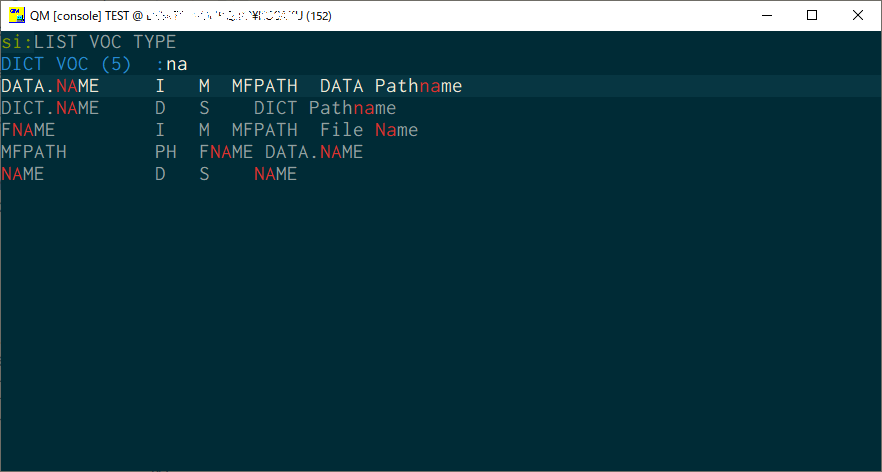
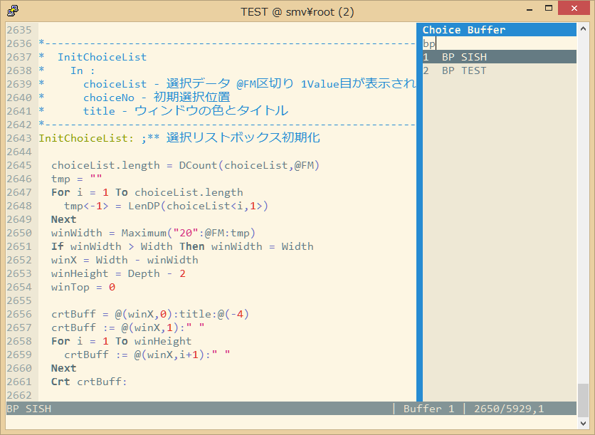

= SISH (SImount Shell) =
:experimental:

Unix like Shell for OpenQM and UniVerse

== 概要 ==

Unix系のShellに近い操作でコマンドライン入力が出来るようになります。 +
また、データ(Item)やBASICソースを効率よく編集するスクリーンエディタも備えています。

== 特徴 ==

.コマンドライン
* VOCに登録されている単語の入力補完機能によりミスが少なく迅速な入力が可能となります。
* 一度入力したコマンドはコマンド履歴から検索する事が出来ます。
* ターミナルサイズを取得して自動的に `TERM` コマンドを実行する機能。
* 大文字小文字反転入力のON/OFFを `F9` で簡単に切り替えれます。
* 実行時間計測モード

.エディタ
* BASICソースもデータレコードも同じ操作感で編集できます。
* BASICソースの構文ハイライト表示により入力ミスが軽減されます。
* カーソル移動の効率を高めるジャンプ機能
  ** アウトライン一覧を表示して指定ラベルにジャンプ
  ** 変数宣言元にジャンプ
  ** ジャンプ前のカーソル位置に戻る
* マルチバリューを改行区切りで編集出来ます。
* バッファ機能により複数ファイルの編集状態を維持できます。

.その他
* コマンドラインとエディタ共にカーソル移動やコピー＆ペーストはWindowsのキーバインドで操作できます。
（設定ファイルにより自分好みにキーバインドに変更可能）

== 対象プラットフォーム ==

* OpenQM 3.4系 or later (3.4-9で動作確認)
* UniVerse 11.2系 or later (11.2.1でコンパイル確認)

== セットアップ ==

=== ターミナルエミュレータ（クライアント環境） ===

`SISH` はxterm系の制御シーケンスが理解できるターミナルエミュレータから接続して使用される必要があります。

動作確認環境として link:https://mintty.github.io/[mintty] で正しく動作する事を確認しています。
設定は同梱のlink:minttyrc[minttyrc]を利用して下さい。

minttyは link:https://cygwin.com/index.html[Cygwin]やlink:https://msys2.github.io/[MSYS2]から利用する事が出来ます。
Windows10 では Bash on Windows(WSL) の利用がおすすめです。link:https://github.com/mintty/wsltty[wsltty]

- Windows版DBへ接続するときはCygwinから `telnet -E localhost 4242` で接続
- Linux版DBへ接続するときはCygwinからtelnet接続かssh接続でサーバに入ってから `qm` を起動

また、他にも以下の端末で動作はしますが、細かい箇所が未確認です。

- link:http://ice.hotmint.com/putty/[putty GDI] (Windows)
  * 同梱のlink:putty.ini[putty.ini]をputty.exeと同階層に配置する事でデフォルト設定にて動作します。
- link:https://help.gnome.org/users/gnome-terminal/stable/[GNOME Terminal](Linux)
- link:https://www.iterm2.com/[iTurm2](Mac)
  * プロファイル設定のKeysのプリセットを `xterm Defaults` に変更
  * プロファイル設定のColorsのプリセットを `Solarized light` に変更

これらの端末で正しく動作させる為には、同梱されているlink:BP/SISH.SETTING.H[SISH.SETTING.H]の
キーシーケンスの設定とカラーパレット設定を端末側とうまく合わせてからコンパイルする必要があるかもしれません。

=== SISHのコンパイルとグローバルカタログ化 ===

同梱のソース `SISH` `SISH.SETTING.H` を `BP` ディレクトリに置きます。
`BP` ディレクトリのファイルエンコーディングは `UTF8` に設定して置く必要があります。

以下のコマンドでどのアカウントからも `SISH` というコマンドで起動できます。

    >BASIC BP SISH
    >CATALOG BP SISH SISH

`SISH.SETTING.H` を独自にカスタマイズした場合は別名でカタログ化するなどして、他の人とバッティング
しないように適宜調節して下さい。

=== Linuxに接続時の注意点 ===

SISHでは `Ctrl` + `Z` と `Ctrl` + `S` をショートカットキーとして使用します。

Linuxでは以下のターミナル制御コードと重複しているのでそれらの機能を利用する場合は、 `SISH.SETTING.H` で
キーバインドを変更するか、以下の方法で抑制する必要があります。

    stty stop undef
    stty susp ^K

=== 機能 ===

==== コマンドライン入力時の単語補完入力機能 ====

単語入力途中に `Tab` で下記の単語を補完、もう一度 `Tab` で候補リストを表示します。

- VOC内の `Verb` , `File` , `PAragraph` , `Keyword` など
- ファイル名が存在する場合にその辞書ファイルのフィールド
- フラットファイルの単語の次の単語の場合に限り、対象フラットファイルのレコードID
- `,` 後のマルチパートファイル
- `LOGTO` コマンドの後は登録アカウントテーブルの内容から補完
- `%` 後のL-Typeフィールドの辞書フィールド補完に対応(OpenQM)
- `server:account:file` 等の拡張ファイル表記(OpenQM)
- 単語に `/` or `\` を含むか　`PATH:` で始まる場合にOSパスの補完(OpenQM)

補完対象の単語は大文字小文字の区別なく検索されます。 +
候補リスト表示中は、 `TAB` を押さなくても自動的に補完されます。 +
`F3` でさらに部分一致とパターンによるフィルターをかける事ができます。 +
`ESC` で候補リスト表示を抜けます。

==== コマンド履歴の保存機能 ====

アカウント内に `./stacks` フォルダを作成しておくことでコマンド実行履歴が +
`ログインユーザ名$プログラム名` の形式で保存されます。 +
SISHシェル起動時や `LOGTO` によるアカウント移動時にそのコマンド実行履歴が存在すると +
そこからコマンド履歴を構築しますので以前に入力した内容が復元されます。

==== 英小文字大文字反転入力の切替機能 ====

`F9` キーでON/OFFを切り替えます

==== カラーテーマの切替機能 ====

`F11` キーでカラーテーマを切り替える事ができます。(OSCによるカラーパレット変更に対応している端末のみ) +
パレットは以下のサイトのSolarized-lightとdarkが利用できます。  +
http://ethanschoonover.com/solarized

==== ターミナルサイズの自動変更機能 ====

`F8` キーでターミナルクライアントのサイズを取得してサイズが違っていた場合に
新しく取得したサイズで `TERM` コマンドを自動的に実行します。

==== クリップボード ====

コピー時にローカル端末のクリップボードに内容を送信します。(OSC52に対応している端末) +
link:https://cirw.in/blog/bracketed-paste[Bracketed Paste Mode] に対応しています。

==== SISH特殊コマンド一覧 ====

以下のコマンドはVerbとして登録されていませんがSISH内でのみ利用できます。

[cols="1,3"]
|===
| キー| 機能

|**.A**__n__ text | _n_ 行目のコマンド履歴の末尾に _text_ を追加。 _n_ は省略すると `1` として扱う。
|**.C**__n__ /__old__/__New__/**G** | _n_ 行目のコマンド履歴の _old_ 文字列を _New_ 文字列に置換。 +
 *G* は繰り返し（省略可能）。/ の区切り文字はどのような文字でも可。 _n_ は省略すると `1` として扱う。

|**.D**__s__-__e__
| コマンド履歴の _s_ ～ _e_ 行目を削除する。 _s_ は省略すると初めの履歴を対象とする。 _e_ 省略で単一行。

|**.D** _name_ | VOCの _name_ が `PA` or `S` なら削除する。

|**.E** +
**.E** _file_ _item_
| スクリーンエディタ起動 +
READ.BUFFER _file_ _item_ のショートネーム

|**.G**__n__ | _n_ 行目のコマンド履歴に移動。 _n_ は省略すると `1` として扱う。

|**.K** | キーシーケンス確認モードに切り替え

|**.L**__n__ _filter_ | コマンド履歴を現在位置から _n_ 件表示。 _n_ は省略すると前回の表示行数を採用する。
filterは部分一致またはパターン一致させたい文字。

|**.L** _name_ | VOCエントリをダンプ出力

|**.R**__s__-__e__
| コマンド履歴の _s_ ～ _e_ 行目を履歴の先頭に持ってくる。 _s_ は省略すると初めの履歴を複製する。 _e_ 省略で単一行。

|**.R** _name_ | VOCの _name_ が `PA` or `S` ならコマンド履歴の先頭に読み込む。

|**.S**__s__-__e__ _name_ | コマンド履歴の _s_ ～ _e_ を VOC に _name_ の PAragraph として保存する

|**.T** | コマンドで時間計測機能をON/OFF

|**.X**__s__-__e__ | _s_ ～ _e_ 行目のコマンド履歴を実行。 _s_ は省略すると `1` として扱う。 _e_ 省略で単一行。

|**Q** | SISHシェルを抜ける
|===

==== スクリーンエディタ ====

起動方法

`Ctrl` + `E` or `.E` コマンド

ファイルを指定して開く場合

    READ.BUFFER [<File> [<Item> <FieldId...>]]

****
[horizontal]
<File>:: 開く対象のFileId。省略した場合は新規バッファを開きます。
<Item>:: 開く対象のItemId。選択リスト時がある場合は省略可能。
<FieldId>:: 指定フィールドを辞書に基づいて編集するモードで起動します。行数表示横にフィールド名が表示されます。 +
Conversion指定があれば保存時に自動的に変換されます。マルチバリューの場合はマルチバリュー編集モードになります。
****

デフォルトのキー操作はWindowsの一般的なテキストエディタにできるだけ合わせています。

.バッファ
マルチバッファ機能にて同時に複数のItemの編集状態を保持できます。  +
`Ctrl` + `B` でバッファ一覧ポップアップが開きますので切り替えたいアイテムを選択してください。 +
バッファは明示的に閉じるまでセッションメモリ（COMMON）に格納され続けます。 +
バッファ毎にUndo/Redoできます。コマンドラインも特殊なバッファとして実装されているのでUndo/Redo可能。

.カーソル移動
マウスは使用することが出来ませんが、 `Ctrl` を押しながらのキー移動やジャンプ機能により
キーボードによる効率的なカーソル移動が可能となっています。

`Ctrl` + `O` でラベル一覧アウトライン表示::
ラベルは実行コードには入らないのでGoToなどで使用しなくてもソースコード上に書いておけばアウトラインから
簡単に目的の場所にジャンプすることができます。

`Ctrl` + `G` or `F12` で宣言元にジャンプ::
- 変数や定数（実際は厳密な宣言元ではなくその単語が初めに出てきた場所にジャンプします）
- `GoSub` や`GoTo` でのラベルやローカルサブルーチン
- `Call` では同一ファイル内にあるファイル
- `$INCLUDE` 行ではインクルード先のファイル

.単語補完
`Ctrl` + `SP` で編集中のテキストから抽出した単語一覧からインクリメンタルサーチで検索した単語を入力できます。
長い単語の省入力とミスを減らすことが出来ます。 +
`$INCLUDE` が存在する場合はそのインクルード先ファイルの単語も一覧に追加されます。

.BASICソース
BASICプログラムは構文が装飾されて表示されます。 +
分岐やループで自動的にインデントが増えます。

.マルチバリューアイテム編集
`F4` によりバリュー区切りを改行として編集できるバッファが開くので簡単にマルチバリューを編集する事が出来ます。 +
保存すると結果は親バッファに反映されます。 +
また、コマンドラインからフィールドを指定することによりマルチバリューをまとめて編集できます。
フィールドの代わりにフレーズも可能ですのでアソシエーションをまとめて編集するのに便利です。

.メニュー
`ESC` キーで画面の下部にメニューが表示されます。
メニューの内のテキストで大文字で表示されているキーを押すとそのメニューを選択できます。

.メニュー一覧
[cols="1,3"]
|===
| ├ **B**uffer      | (バッファ操作関連サブメニュー)
| │├ **S**howlist  | バッファ一覧表示
| │├ **N**ew       | バッファ新規作成
| │├ **R**ead      | 新規バッファにリード
| │├ **W**rite     | バッファの内容を保存
| │├ write**A**s   | バッファの内容を別なアイテムに保存
| │├ r**E**load    | このバッファの内容をリロード
| │├ **C**lose     | このバッファを閉じる
| │├ **L**ock      | このバッファの対象アイテムを更新ロック
| │├ **D**elete    | このバッファの対象アイテムを削除する
| │└cl**O**se_all  | 全バッファを閉じる
| ├ **E**dit        | (編集操作関連サブメニュー)
| │├ **U**ndo      | アンドゥ
| │├ **R**edo      | リドゥ
| │├ (**X**)cut    | カット
| │├ **C**opy      | コピー
| │├ **P**aste     | シェル内のクリップボードからペースト
| │└ [paste from **L**ocal] | クライアント端末のクリップボードからペースト(OSC52)
| ├ **I**ns         | (挿入系サブメニュー)
| │├ **C**omment   | コメント行を挿入
| │├ **J**oin      | 選択範囲の行を指定文字で置換して１行にする
| │├ **O**Conv     | 選択範囲をOConv出力結果に変換
| │├ **I**Conv     | 選択範囲をIConv出力結果に変換
| │├ **D**ate      | 現在日付の内部値を挿入
| │├ **T**ime      | 現在時刻の内部値を挿入
| │├ **R**ecord    | 指定のItemの内容を挿入
| ├ **C**ode        | (コード系サブメニュー)
| │├ **B**uild     | 現在編集中のソースをコンパイルする
| │├ **C**atalog   | 現在編集中のソースをカタログ化する
| │├ **F**ormat    | 現在編集中のソースをFORMATコマンドでフォーマットする
| │├ **W**ords     | 単語補完
| │├ **M**ode      | (モード切替サブメニュー)
| ││├ **B**asic   | BASIC編集モードにする
| ││├ **P**aragraph | PHaragraph編集モードにする
| ││├ **D**ata    | DATA編集モードにする
| │├ **I**ndent    | (インデント設定変更サブメニュー)
| ││├ **T**ab     | インデントにTABを利用する
| ││├ **S**paces  | インデントにスペースを利用する
| │└ **H**elp      | カーソル上の単語のヘルプを表示(UniVerseのみ)
| ├ **N**avi        | (ナビゲーション系サブメニュー)
| │├ **F**ind      | 検索
| │├ **A**gain     | 前回の単語で次を検索
| │├ re**V**erse   | 前回の単語で前を検索
| │├ **R**eplace   | 置換
| │├ go**L**ineno  | 指定行へ移動
| │├ go**D**eclaration | 宣言元へ移動
| │└ **O**utline   | アウトライン一覧表示
| ├ **T**ools       | (ツール系サブメニュー)
| │├ **T**heme     | テーマ切り替え
| │└ **K**eys      | キーシーケンス確認モードに切り替え
| ├ **M**ark        | (ブックマーク系サブメニュー)
| │├ **S**et       | ブックマークを設定
| │└ **G**o        | 設定したブックマークへ移動
| ├ e**X**it        | エディタを終了してコマンドラインに戻る
| └ **ESC**         | メニューを終了してエディタ操作へ戻る
|===

== キー別機能一覧 ==

=== コマンドライン/エディタ共通 ===

==== カーソル操作系 ====
|===
| キー| 機能

| `→` | 右移動
| `←` | 左移動
| `↑` | 上移動
| `↓` | 下移動
| `Ctrl` + `→` |  次の単語に移動 +
カーソルが単語の先頭にある場合は次の単語の先頭に移動 +
カーソルが単語の先頭にない場合は単語区切りを認識して単語の終端に移動 +
カーソルが対応する括弧上にある場合は対応する括弧まで移動 +
 +
単語の区切りとは `aaa.bbb.ccc` `aaaBbbCcc` `aaa_bbb_ccc` 等です。

| `Ctrl` + `←` |  前の単語に移動 +
カーソルが単語の先頭にある場合は前の単語の先頭に移動 +
カーソルが単語の先頭にない場合は単語区切りを認識して単語の先頭に移動 +
カーソルが対応する括弧上にある場合は対応する括弧まで移動
| `Ctrl` + `↑` |  3行前に移動（先が非表示文字の場合は表示文字）
| `Ctrl` + `↓` |  3行先に移動（先が非表示文字の場合は表示文字）
| `HOME` |  論理行頭/物理行頭へ移動
| `END` |  行末へ移動
| `Ctrl` + `HOME` |  データの先頭へ移動
| `Ctrl` + `END` |  データの末尾へ移動
| `PgUp` |  半ページ戻る
| `PgDn` |  半ページ進む
| `Ctrl` + `PgUp` |  前のページ戻る
| `Ctrl` + `PgDn` |  次のページ進む
| `Ctrl` + `.` |  続けて入力した1文字が次に出現する位置に移動 +
連続で同じ文字を入力するとさらに次に出現する位置に移動
| `Ctrl` + `,` |  続けて入力した1文字が遡って次に出現する位置に移動 +
連続で同じ文字を入力するとさらに次に出現する位置に移動
|===

※上記にさらに `Shift` 同時押しで範囲選択します

カーソル移動早見表

                                 Ctrl+Home
                                     |
                                 Ctrl+PgUp
                                     |
                                    PgUp
                                     |
                                   Ctrl+↑
                                     |
                                     ↑
                                     |
        Home  --  Ctrl+<-  --  <-  --|--  ->  --  Ctrl+->  --  End
                                     |
                                     ↓
                                     |
                                   Ctrl+↓
                                     |
                                   PgDown
                                     |
                                Ctrl+PgDown
                                     |
                                  Ctrl+End

==== 編集操作系 ====
|===
| キー| 機能

| kbd:[Ctrl + Z] | アンドゥ
| `Ctrl` + `Y` | リドゥ
| `Ctrl` + `X` | カット
| `Ctrl` + `C` | コピー
| `Ctrl` + `V` | SISH内のクリップボードからペースト
| `Alt` + `V` | クライアント端末のクリップボードからペースト(OSC52)
| `Ctrl` + `Shift` + `V` | クライアント端末のクリップボードからペースト(minttyのキーバインド)
| `Ctrl` + `K` | 行削除
| `Ctrl` + `A` | 全行選択
| `Ctrl` + `D` | 選択領域の拡張（押すたびに以下を繰り返します） +
`選択なし` -> `単語選択` -> `空白文字まで選択` -> `1行選択` -> `同一インデント行を選択` -> `選択なし`
|===

==== その他 ====
|===
| キー| 機能

| `Insert` | 挿入モード/上書きモード切り替え
| `F11`    | テーマ切り替え
| `F1`     | カーソル上の単語をヘルプ表示(UniVerseのみ)
| `ESC`    | いろいろな場面でキャンセル
|===

=== コマンドラインのみ ===

|===
| キー| 機能

| `↑` | コマンド履歴戻る
| `↓` | コマンド履歴進む
| `Ctrl` + `HOME` | コマンド履歴の先頭へ移動
| `Ctrl` + `END` |  コマンド履歴の末尾へ移動
| `Ctrl` + `R` | コマンド履歴を古い方にインクリメンタルサーチ
| `Ctrl` + `S` | コマンド履歴を新しい方にインクリメンタルサーチ
| `TAB` | 1回押下で共通部分の文字補完、２回押下で補完候補をリスト表示モード
| `PgUp` | 補完候補リストのページ戻り
| `PgDn` | 補完候補リストのページ送り
| `F3` | 候補リストの部分一致フィルタ入力
| `Ctrl` + `T` | 直前のコマンドのファイル名を挿入
| `Ctrl` + `E` | スクリーンエディタ画面に切り替え
|===

=== エディタのみ ===

`CHAR(27)` = ( `ESC` or `Ctrl` + `[` or `Ctrl` + `3` ) or `F10` でメニューを表示

|===
| キー| 機能

| `Ctrl` + `N` | カーソル行が画面の中央になるようにスクロールします
| `TAB` | `TAB` の挿入。選択中ならインデントを増やす
| `Shift` + `TAB` | 選択中ならインデントを減らす
| `Ctrl` + `SP` | 単語補完
| `Ctrl` + `5` | @VMの挿入
| `Ctrl` + `4` | @SVMの挿入
| `Ctrl` + `D` | 行削除
| `Ctrl` + `/` | 選択領域のコメント化/コメント化解除
| `Ctrl` + `F` | 単語検索
| `F3` | 直前の単語検索をもう一度実行
| `Ctrl` + `F3` | 直前の単語検索を逆戻りで実行
| `Ctrl` + `R` | 単語置換
| `Ctrl` + `L` | 行番号指定ジャンプ
| `Ctrl` + `G` or `F12` | 定義元へジャンプ
| `Ctrl` + `O` | アウトライン(ラベル一覧)ポップアップ表示
| `Ctrl` + `B` | バッファ一覧ポップアップ表示
| `Alt` + `→` | ジャンプ履歴進む
| `Alt` + `←` | ジャンプ履歴戻る
| `Ctrl` + `S` | 上書き保存
| `Ctrl` + `F4` | Bufferを閉じる
| `F5` | リロード
| `F7` | コンパイル
| `F4` | 下位レベルにDive(カーソル行の内容を下位の区切りレベルの編集モードとして新しいバッファに開きます) +
バリュー区切りが改行になるので簡単に編集できます。
| `Ctrl` + `E` | コマンドライン画面に切り替え
|===

== 制限事項 ==

- UniVerse版ではコマンド実行中にAbortするとSISHごとAbortします。

== おまけ ==

おすすめのフォント設定は Consolas + MeiryoKe_Console です。

以下のサイトに詳しい導入方法が載っています。 +
http://d.hatena.ne.jp/amachang/20111226/1324874731

以下は適応した場合の画面キャプチャー  +

導入方法は少しややこしいですが、MSゴシックより見やすくなるのでとても捗ります。

== 更新履歴 ==

=== 2016/12/16 - 0.13.0 ===

- `[NEW]` `.D` でコマンド履歴を削除できるようにした追加
- `[Imp]` コマンドラインモードのペーストが Bracketed Paste Mode なら大小文字反転しないようにした。
  - 合わせて起動時に大文字小文字反転モードをデフォルトにした。
- `[Imp]` バッファ情報の表示方法でアカウント登録されているアカウント名はショートネームで表示するように変更
- `[Imp]` 行削除のキーバインドを `Ctrl` + `D` から `Ctrl` + `K` に変更
- `[Imp]` `Ctrl` + `A` の選択範囲拡張は `Ctrl` + `D` に変更。`Ctrl` + `A` は全選択のみに戻しました。
- `[Imp]` 単語移動でカーソルが単語の途中の場合は単語の終端に移動するように変更
- `[Imp]` カーソル移動による選択範囲解除時の挙動を変更
- `[Imp]` インデント増減でコメント行を固定にする処理をややこしいのでやめました
- `[Imp]` アウトライン表示に `$INCLUDE` を含めるようにしました。
- `[Bug]` 単語入力補完機能でインクルード先が正しく取り込まれていなかった問題を修正
- `[Bug]` バッファクローズ後の画面の描画が崩れる問題を修正
- `[Bug]` ファイルが見つからないバッファをクローズできない問題を修正

=== 2016/12/16 - 0.12.1 ===

.エディタ
- `[Bug]` 単語入力補完機能で行の先頭で起動した場合に永久ループに入る問題を修正

=== 2016/12/15 - 0.12.0 ===

.エディタ
- `[New]` エディタ内単語の入力補完機能
- `[Imp]` 宣言元へジャンプの機能でインクルード先も対象とした
- `[Imp]` 宣言元へジャンプの機能でGoSubのローカルサブルーチンへも飛べるようにした(OpenQM)

=== 2016/11/01 - 0.11.0 ===

.コマンドライン
- `[New]` minttyのキーバインドとカラーパレットで正しく動作するように調整しました。
- `[New]` ターミナルサイズの自動設定をコマンド実行毎をやめてキーアクションにて任意にしました。
- `[New]` `Ctrl` + `L` で前回の `.L` 内容を再実行
- `[Bug]` PTERM ERASE の初期値が `^H` になるように修正(OpenQM)
- `[Bug]` 一番最後の候補が表示されない場合がある問題を修正

=== 2016/10/19 - 0.10.0 ===

.コマンドライン
- `[New]` Saved List系コマンドでファイル省略での補完に対応
- `[New]` 補完キーワード検索時に大文字小文字を区別しないようにした
- `[New]` 補完候補の表示方法を変更
- `[New]` 拡張ファイル指定の補完に対応
- `[New]` OSファイルの補完に対応
- `[New]` 履歴のインクリメンタルサーチ起動時にカーソルまでのコマンドラインを初期値とした
- `[New]` コマンドスタックの最大件数を999に拡張
- `[New]` コマンド履歴のストレージ保存に対応
- `[New]` .R .G 内部コマンド追加　.X を範囲指定して実行できるようにした
- `[Bug]` 空文字への置換が出来ない問題を修正

.エディタ
- `[New]` メニューからモードを切り替えれるようにした
- `[New]` エディタメニューからイン定を変更できるようにした
- `[Bug]` ALL置換時に同一行で初めの１つしか置き換わらない問題を修正
- `[Bug]` 検索結果のカーソル位置が対応する括弧の場合に表示がわからない問題を修正

.その他
- `[New]` 挿入モード/上書きモードの切り替え機能の追加。それに伴い大文字小文字反転の切り替えは `F9` に変更
- `[Bug]` IMEなどの連続文字列が入力されない問題を修正

=== 2016/09/02 - 0.9.2 ===

.エディタ
- `[Bug]` 0.9.0に修正により辞書のレコードをコマンド指定してエディタで開けなくなっていた問題を修正

.その他
- `[Bug]` 制御シーケンスのゴミが入りにくくする機能により日本語入力に影響が出ていたので修正しました。

=== 2016/08/16 - 0.9.1 ===

.コマンドライン
- `[New]` 初回起動時にバージョンを表示するようにした
- `[Bug]` 空コマンドを実行した時に`SI`が残る問題を修正
- `[Bug]` テーマ切り替えが初回時に変わらない問題を修正

=== 2016/07/07 - 0.9.0 ===

.コマンドライン
- L-Typeの辞書フィールド補完に対応
- Basic系コマンド利用時にBPを省略するとBP.OUTの内容を補完するようになりました。
- Ctrl+Rでのコマンド履歴のインクリメンタルサーチが出来るようになりました。

.エディタ
- ITEM編集時にカーソル上のフィールドでF4キーを押すとマルチバリューを１行として編集するモードに移行する機能を追加
- エディタ起動のコマンドラインにてフィールドを指定することで辞書駆動編集に対応
  * マルチバリューの同一アソシエーションを指定する事で連動して編集することができます。
  * Conversion等も自動的に変換されて保存されます。
- ステータスバーにカーソル上のキャラコードを表示
- 改行マークとタブを視認できるようにした
- Ctrl+Aで選択領域を拡張していく機能を追加
- 条件文やループ文の後に改行すると自動でインデントを設定するようにした

.その他
- キーシーケンスとカラーパレットの設定部分のソースを別ファイルにしました。

=== 2014/09/10 - 0.8.0 ===

- 初回リリース

== TODO ==

- wordsの表示エリアをクリアしたい
- コマンドスタックをエディタで編集
  - コマンド履歴もバッファの１つにしたい
- LOGTOをスタックできないものか検討
- 候補表示でのヘルプ表示を `F1` でON/OFF切り替えれるようにする
- `Ctrl` + `G` でコマンド履歴の指定行へジャンプするインクリメンタルサーチを実行
- 履歴の候補表示に対応する
- 候補表示時のヘルプ表示でヘルプファイルがあればそちらを優先的に表示する

== License ==

link:LICENSE[GPLv2]
